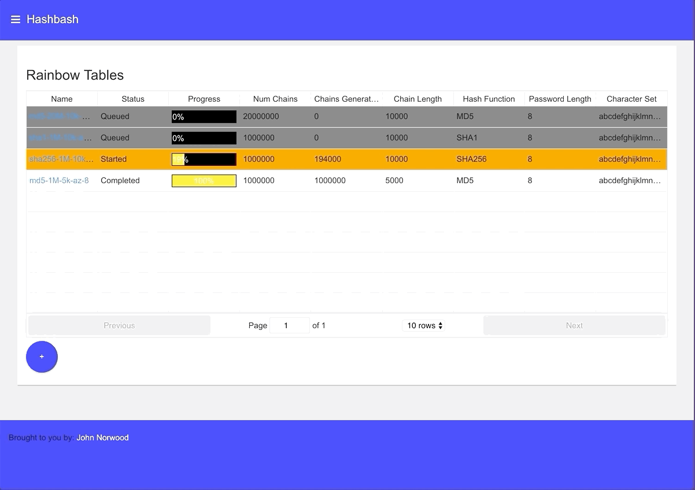

Hash Bash Backend Go
====================


This project is a rewrite of the [hashbash-backend-java](https://github.com/norwoodj/hashbash-backend-java)
project I wrote a couple years ago. That project was itself a rewrite of a C++ implementation of rainbow tables that I
wrote in college.

The goal in writing the java version was both to implement a web interface around rainbow tables, providing a frontend
for viewing/searching rainbow tables, and to implement the generation of rainbow tables using [spring batch](https://spring.io/projects/spring-batch).
The company I worked for at that time heavily used spring batch, java, and react and so writing that project was my
way of getting a deep-dive into all of those technologies.

This version of the project is a complete rewrite of the java version of the project in [go](https://golang.org). I _love_
go, and have been trying to convince my coworkers/friends/grandparents of its merits for a long time, to little avail.

This version of hashbash is my next aggressive attempt to convince everyone. I have compared the performance of the java
and go versions of this project and compiled the results into a [blog post](https://medium.com/@norwood.john.m/hashbash-a-comparison-of-cpu-and-io-bound-applications-in-go-and-java-across-multiple-metrics-d358df6e03b1).

Aside from proving to the world how great go is, this was an excellent opportunity to get more familiarity with writing
complicated applications in go, as well as gaining experience using the following wonderful libraries:
* [gorilla web toolkit](https://www.gorillatoolkit.org)
* [gorm](https://gorm.io)
* [prometheus/client_golang](https://github.com/prometheus/client_golang)
* [streadway/amqp](https://github.com/streadway/amqp)


### Building and Developing Locally
In order to build, run and develop this project locally you'll need a number of things installed:

* docker
* docker-compose
* make
* go >= 1.12 (although you can run the docker version without this)

To build the go binaries:
```
cd cmd/hashbash-cli
go build

cd cmd/hashbash-engine
go build

cd cmd/hashbash-webapp
go build
```

To build the docker images
```
make
```

To run the application locally in docker:
```
make run
```

To run the application on your host machine, with rabbitmq and mysql in docker:
```
make run-deps
```

And finally, to publish the docker images to a docker registry:
```
make push
```
